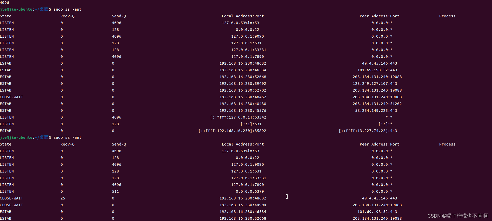

在内核中维护了两个队列，全连接队列，半连接队列。
他们在下图中表示。
可以看到在收到客户端的SYN包之后，就会将这个socket放入半连接队列。在服务端收到最后一个ack的时候，放入全连接队列。

##### 下面开始细节说明：
**1.全连接队列大小的设置？**
 第一点要知道的，这两个队列是针对socket级别来说的。比如说有A,B两个socket，那么这两个socket的这两个队列（既然是队列，那么必然可以设置大小）的大小可以不一样。也就是说可以单独为某一个socket设置一个队列的最大大小。
具体的设置全连接队列大小的方法是在调用listen()方法的时候，第二个参数可以传入。
比如说Redis源码中的：
```c
int anetTcpServer(char *err, int port, char *bindaddr)
{
    int s, on = 1;
    struct sockaddr_in sa;
    
    if ((s = socket(AF_INET, SOCK_STREAM, 0)) == -1) {
        anetSetError(err, "socket: %s\n", strerror(errno));
        return ANET_ERR;
    }
    if (setsockopt(s, SOL_SOCKET, SO_REUSEADDR, &on, sizeof(on)) == -1) {
        anetSetError(err, "setsockopt SO_REUSEADDR: %s\n", strerror(errno));
        close(s);
        return ANET_ERR;
    }
    memset(&sa,0,sizeof(sa));
    sa.sin_family = AF_INET;
    sa.sin_port = htons(port);
    sa.sin_addr.s_addr = htonl(INADDR_ANY);
    if (bindaddr) {
        if (inet_aton(bindaddr, &sa.sin_addr) == 0) {
            anetSetError(err, "Invalid bind address\n");
            close(s);
            return ANET_ERR;
        }
    }
    if (bind(s, (struct sockaddr*)&sa, sizeof(sa)) == -1) {
        anetSetError(err, "bind: %s\n", strerror(errno));
        close(s);
        return ANET_ERR;
    }
    if (listen(s, 511) == -1) { /* the magic 511 constant is from nginx */   // 这里就是redis传入的全连接队列大小
        anetSetError(err, "listen: %s\n", strerror(errno));
        close(s);
        return ANET_ERR;
    }
    return s;
}
```
但是仅仅在这个listen方法传入还不够，内核还会读取一个/proc/sys/net/core/somaxconn的值，然后取这两个值的最小值。
现在在我的Linux机器上面看一下这个值是什么？
```shell
jie@jie-ubuntu:~/桌面$ sudo cat /proc/sys/net/core/somaxconn
4096
```
可以看到是4096，于是redis在listen传入的511小于4096，于是最终取的是511。
那么到这里，我们已经知道怎样设置某一个socket的全连接队列的大小。
总结公式如下：
`len(全连接队列) = min(/proc/sys/net/core/somaxconn , listen()方法的第二个参数)`


**2. 有没有办法能直观的看到这个队列？**
并且对于socket来说，可以使用ss命令来查看本机中的所有socket的这两个队列的信息。
直接在本机试一把：

可以看到使用ss命令就可以列出本机所有的socket的这个队列的相关信息了。
可以发现，左边，有些state是LISTEN状态，有些三ESTAB状态。这是为什么呢？
这就要回到最上面那个图了。对于服务端来说，在调用listen方法之后，这个socket就是LISTEN状态。那么后续当有客户端来进行了三次握手，并建立连接之后，那么就会多出一个ESTAB的连接。但是原来的LISTEN还是在的。
那么对于这两种不同的状态，ss命令的输出表示其实是不一样的。
解释如下：
在「LISTEN 状态」时，Recv-Q/Send-Q 表示的含义如下：
Recv-Q：当前全连接队列的大小，也就是当前已完成三次握手并等待服务端 accept() 的 TCP 连接；
Send-Q：当前全连接最大队列长度，上面的输出结果说明监听 8088 端口的 TCP 服务，最大全连接长度为 128；

在「非 LISTEN 状态」时，Recv-Q/Send-Q 表示的含义如下：
Recv-Q：已收到但未被应用进程读取的字节数；
Send-Q：已发送但未收到确认的字节数；
到这里就能看懂上面的输出是什么意思了。
接下来开始验证，我打算用Redis来验证上面的说法。首先我启动Redis，然后在Redis服务端调用listen之后，使用ss命令输出一下，看一下全连接队列的情况。
第一步：
开启redis，单点到redis服务器端执行完毕listen的地方。
可以看到如下截图，第一次执行的时候，没有6379的socket，在listen之后，就有了：


第二步：
那么，这个时候，还是没有客户端连接的，这个时候，我使用redis-cli连接上去。
但是我并不要在redis服务器端调用accept，这个时候观察全连接队列的大小。

可以看到，已经卡在这里了。
转到服务器端，并没有执行accept，那么这个时候再去使用ss命令。

果然，能够看到listen状态的socket在6379上面的全连接队列有一个1.

接下来调用accept函数。

可以看到此时已经建立了一个ESTAB的连接了，由于这个连接发送了 set k3 v4的命令，所以，这个连接接收到了14个字节的数据。
所以显示的是14。
那么，到这里已经知道如何观察本机中的socket的全连接队列了。

**3. 全连接队列满了会发生什么？**
当超过了 TCP 最大全连接队列，服务端则会丢掉后续进来的 TCP 连接，丢掉的 TCP 连接的个数会被统计起来，我们可以使用 netstat -s 命令来查看：

Linux 有个参数可以指定当 TCP 全连接队列满了会使用什么策略来回应客户端。

实际上，丢弃连接只是 Linux 的默认行为，我们还可以选择向客户端发送 RST 复位报文，告诉客户端连接已经建立失败。

tcp_abort_on_overflow 共有两个值分别是 0 和 1，其分别表示：

0 ：如果全连接队列满了，那么 server 扔掉 client 发过来的 ack ；
1 ：如果全连接队列满了，server 发送一个 reset 包给 client，表示废掉这个握手过程和这个连接；
如果要想知道客户端连接不上服务端，是不是服务端 TCP 全连接队列满的原因，那么可以把 tcp_abort_on_overflow 设置为 1，这时如果在客户端异常中可以看到很多 connection reset by peer 的错误，那么就可以证明是由于服务端 TCP 全连接队列溢出的问题。
通常情况下，应当把 tcp_abort_on_overflow 设置为 0，因为这样更有利于应对突发流量。
举个例子，当 TCP 全连接队列满导致服务器丢掉了 ACK，与此同时，客户端的连接状态却是 ESTABLISHED，进程就在建立好的连接上发送请求。只要服务器没有为请求回复 ACK，请求就会被多次重发。如果服务器上的进程只是短暂的繁忙造成 accept 队列满，那么当 TCP 全连接队列有空位时，再次接收到的请求报文由于含有 ACK，仍然会触发服务器端成功建立连接。
所以只要不要回复RST，那么虽然服务器端把这个连接丢弃了，但是客户端并没有放弃，所以后续还是有机会重新建立连接的。当服务器端由于全连接队列满了，然后丢弃了这个第三次握手的报文之后，服务器就等于没有收到第三次握手报文，那么服务器就会重试第二次握手报文，然后又由于客户端没有收到rst，所以客户端就还有机会和服务器端建立连接。

**4. 半连接队列满了呢？**
在前面可以看到，当服务端收到SYN包的时候，就会在半连接队列中加入一个连接。
那么当发生SYN攻击的时候，就会有大量的半连接。
此时可以通过如下方式改善：
方式一：增大半连接队列
在前面源码和实验中，得知要想增大半连接队列，我们得知不能只单纯增大 tcp_max_syn_backlog 的值，还需一同增大 somaxconn 和 backlog，也就是增大全连接队列。否则，只单纯增大 tcp_max_syn_backlog 是无效的。
增大 tcp_max_syn_backlog 和 somaxconn 的方法是修改 Linux 内核参数：
增大 backlog 的方式，每个 Web 服务都不同，比如 Nginx 增大 backlog 的方法如下：
最后，改变了如上这些参数后，要重启 Nginx 服务，因为半连接队列和全连接队列都是在 listen() 初始化的。

方式二：开启 tcp_syncookies 功能
开启 tcp_syncookies 功能的方式也很简单，修改 Linux 内核参数：
这个功能就是说服务器端会在ACK+SYN包回复的时候，计算出一个cookie值，并在这个包回复的时候给带上，如果第三次握手的时候，客户端将这个值传回来了，并且服务器端校验这个值是对的话，那么直接将这个连接建立了。
因为SYN攻击的特点是不返回第三次握手的包，所以对于正常的连接来说，就能够正常的建立连接了，而对于SYN攻击的话，就直接丢弃了。

方式三：减少 SYN+ACK 重传次数
当服务端受到 SYN 攻击时，就会有大量处于 SYN_RECV 状态的 TCP 连接，处于这个状态的 TCP 会重传 SYN+ACK ，当重传超过次数达到上限后，就会断开连接。
那么针对 SYN 攻击的场景，我们可以减少 SYN+ACK 的重传次数，以加快处于 SYN_RECV 状态的 TCP 连接断开。

